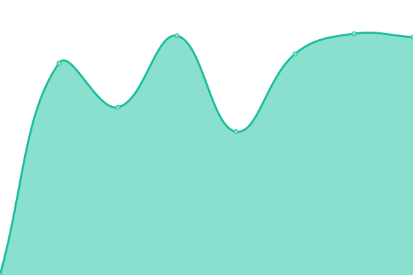
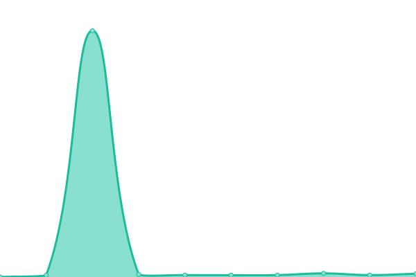

# [📈 Live Status](https://Scaldy.github.io/ALADI_Sites_Monitor): <!--live status--> **🟧 Partial outage**

This repository contains the open-source uptime monitor and status page for [Marcelo Scaldaferro](https://scaldy.github.io/Marcelo-Scaldaferro/), powered by [Upptime](https://github.com/upptime/upptime).

With [Upptime](https://upptime.js.org), you can get your own unlimited and free uptime monitor and status page, powered entirely by a GitHub repository. We use [Issues](https://github.com/Scaldy/ALADI_Sites_Monitor/issues) as incident reports, [Actions](https://github.com/Scaldy/ALADI_Sites_Monitor/actions) as uptime monitors, and [Pages](https://Scaldy.github.io/ALADI_Sites_Monitor) for the status page.

<!--start: status pages-->
<!-- This summary is generated by Upptime (https://github.com/upptime/upptime) -->
<!-- Do not edit this manually, your changes will be overwritten -->
<!-- prettier-ignore -->
| URL | Status | History | Response Time | Uptime |
| --- | ------ | ------- | ------------- | ------ |
|  Web Institucional | 🟩 Up | [web-institucional.yml](https://github.com/Scaldy/ALADI_Sites_Monitor/commits/HEAD/history/web-institucional.yml) | 

 2173ms
     
 | 

<a href="https://Scaldy.github.io/ALADI_Sites_Monitor/history/web-institucional">100.00%</a>
    

|  SICOEX | 🟥 Down | [sicoex.yml](https://github.com/Scaldy/ALADI_Sites_Monitor/commits/HEAD/history/sicoex.yml) | 

 0ms
     
 | 

<a href="https://Scaldy.github.io/ALADI_Sites_Monitor/history/sicoex">0.00%</a>
    

|  Acceso a Mercados | 🟩 Up | [acceso-a-mercados.yml](https://github.com/Scaldy/ALADI_Sites_Monitor/commits/HEAD/history/acceso-a-mercados.yml) | 

 1793ms
     
 | 

<a href="https://Scaldy.github.io/ALADI_Sites_Monitor/history/acceso-a-mercados">100.00%</a>
    

|  SCOD | 🟩 Up | [scod.yml](https://github.com/Scaldy/ALADI_Sites_Monitor/commits/HEAD/history/scod.yml) | 

 1433ms
     
 | 

<a href="https://Scaldy.github.io/ALADI_Sites_Monitor/history/scod">100.00%</a>
    

|  PLGN | 🟩 Up | [plgn.yml](https://github.com/Scaldy/ALADI_Sites_Monitor/commits/HEAD/history/plgn.yml) | 

 2487ms
     
 | 

<a href="https://Scaldy.github.io/ALADI_Sites_Monitor/history/plgn">100.00%</a>
    

|  [Prueba_No_Existe](https://www.google.com) | 🟩 Up | [prueba-no-existe.yml](https://github.com/Scaldy/ALADI_Sites_Monitor/commits/HEAD/history/prueba-no-existe.yml) | 

 93ms
     
 | 

<a href="https://Scaldy.github.io/ALADI_Sites_Monitor/history/prueba-no-existe">100.00%</a>
    

|  Prueba_Error_500 | 🟩 Up | [prueba-error-500.yml](https://github.com/Scaldy/ALADI_Sites_Monitor/commits/HEAD/history/prueba-error-500.yml) | 

 1532ms
     
 | 

<a href="https://Scaldy.github.io/ALADI_Sites_Monitor/history/prueba-error-500">100.00%</a>
    

<!--end: status pages-->

[**Visit our status website →**](https://Scaldy.github.io/ALADI_Sites_Monitor)

## 📄 License

- Powered by: [Upptime](https://github.com/upptime/upptime)
- Code: [MIT](./LICENSE) © [Marcelo Scaldaferro](https://scaldy.github.io/Marcelo-Scaldaferro/)
- Data in the `./history` directory: [Open Database License](https://opendatacommons.org/licenses/odbl/1-0/)
